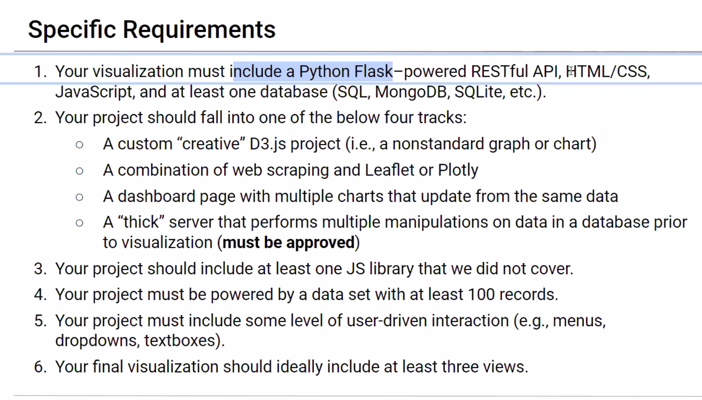
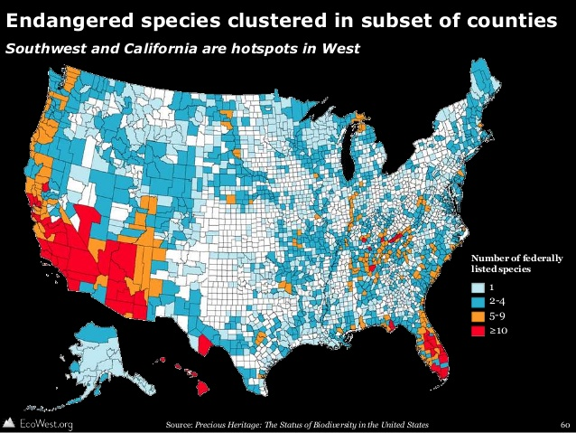

# THE DATA DIVERS
## Project-2

## Endangered Species in Australia

## Proposal: 
Using Environmental data from Australian Government databases and websites to map the location and status of endangered fauna and animals in different conservation zones. Conservation zones are from the [Department of Agriculture](https://data.gov.au/data/dataset/conservation-management-zones-of-australia). The focus will be centred around a map, with zoom in and 'clickability' to interact with the data. Data can be filtered on species type which will change interactive visualisations. 

## Requirements: 

 

## Methodology: 

1. Create HTML and CSS files with layouts and stylings that will hold our visualisations.   

2. Create our MongoDB database for csv and json data. 

3. Using Flask to access database and deliver data to HTML 

4. Using Javascript to interact with our data ( via flask) and create visualisations. 

## Estimated project timing 

Thurs: (1/2 class) : Set up branches for individual tasks. What we have/what we need.  

Saturday: (full class): Have collected all the data we need. Have a solid idea of direction. By end of class rediscuss timeline. 

## Tasks: 

Bonner: Flask App 

Kirstie: HTML 

Conor: Interogate data - create some interesting charts 

Amy: Find map layer data 

## Visualisations to be included: 

*Bar char of number of species. 

*Map of their location 

*Compare endangered locations with conservation zones 

*VIOLIN PLOTS! 

### Datasets: 

[Data1](https://services.slip.wa.gov.au/public/rest/services/SLIP_Public_Services/Environment/MapServer/23?f=pjson)

[Data2](https://data.gov.au/data/dataset/threatened-species-state-lists)

[Data3](https://getflywheel.com/layout/best-javascript-libraries-frameworks-2020/)

[Data4](http://www.environment.gov.au/cgi-bin/sprat/public/publicreports.pl?proc=species)

[Data5](https://www.environment.gov.au/sprat-public/action/report)

### Inspiration

  

  

 

 