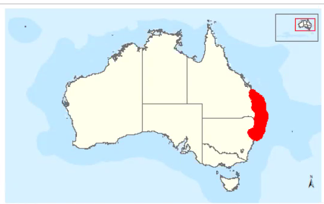
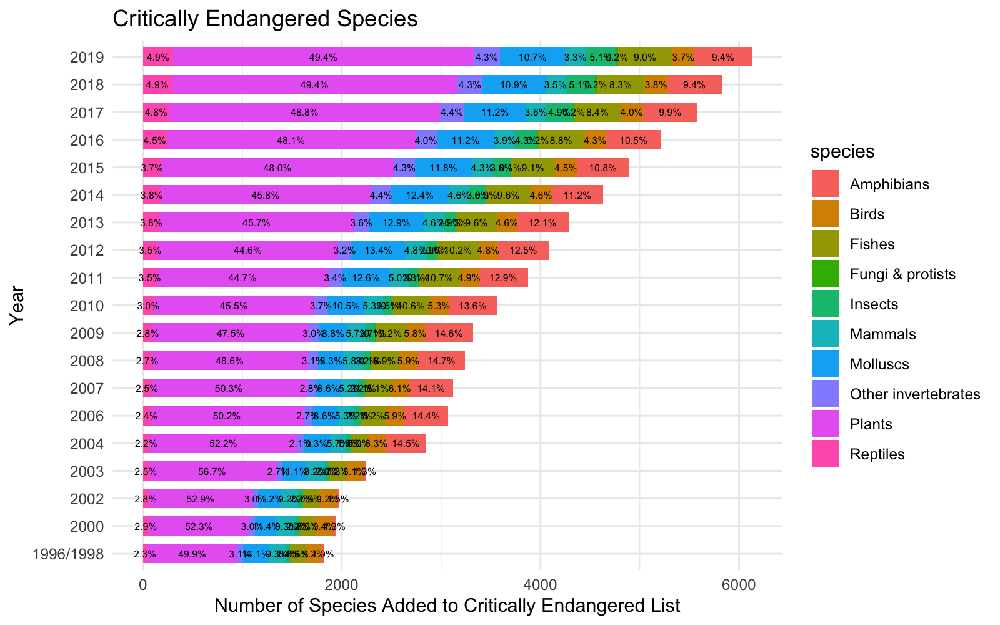
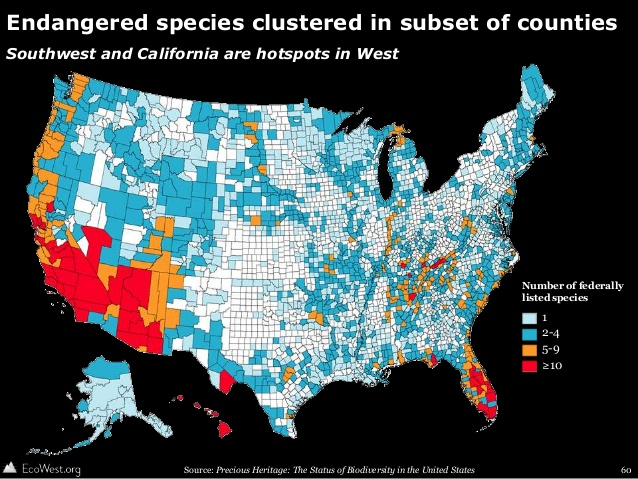

# Project-2

## Endagered Species in Australia

### Proposal: 
Using Environmental data from [CSIRO](https://data.csiro.au/dap/home?execution=e1s1/) to map the location the species and their remaining numbers in each location in relation to conservation zones from ( [Department of Agriculture](https://data.gov.au/data/dataset/conservation-management-zones-of-australia) ). The focus will be centred around a map, with zoom in and 'clickability' to interact with the data. Data can be filtered on species type which will change interactive visualisations. 

The requirements of the project are : 

 

### Visualisations to be included: 

*Bar char of number of species. 

*Map of their location 

*Compare endangered locations with conservation zones 

*VIOLIN PLOTS! 

### Inspiration

  

 

  

 

 