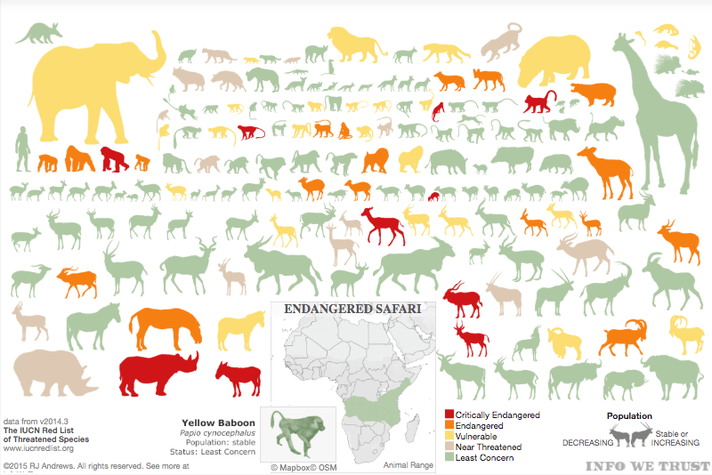

# Project-2

## Endagered Species in Australia

###Proposal: Using Environmental data from [CSIRO](https://data.csiro.au/dap/home?execution=e1s1/) to map the location the species and their remaining numbers in each location in relation to conservation zones from ( [Department of Agriculture](https://data.gov.au/data/dataset/conservation-management-zones-of-australia) ). 

###Visulisations to be included: 

*Bar char of number of species. 

*Map of their location 

*Compare endangered locations with conservation zones 

### Inspiration

 

  

 