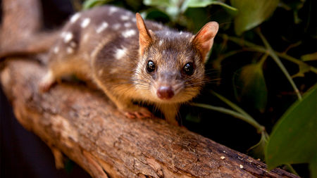

# THE DATA DIVERS
## Project-2

## Endangered Species in Australia

## Proposal: 
Using Environmental data from Australian Government databases and websites to map the location and status of endangered fauna and animals in different conservation zones. Conservation zones are from the [Department of Agriculture](https://data.gov.au/data/dataset/conservation-management-zones-of-australia). 

## Requirements: 

 

## Methodology: 

1. Created HTML and CSS files with layouts and stylings that will hold our visualisations. This included several pages, dashboard creation and the inclusion of the picture carousel. 

2. Searched and collected data from many different governmental and evironmental sources. 

3. Cleaned the data using Panda's, dropping any columns which had data that is not useful for visualising.

4. Created our SQL database and imported data into our postgres database.

5. Used our Flask app to connect to our database and deliver data to HTML in json format. 

6. Javascript files interact with our data ( via flask) and create visualisations.

7. FInally, JS is linked into our html and CSS to format the visualisation and present

 After have loaded into our database we have used a flask api to connect to the database and read the SQL back into a pandas dataframe then return that data as a json format. We used the JSON to populate our javascript and create visualisations, this is then linked into our html and CSS to format the visualisation and present.

## Tasks: 

Bonner: Flask App 

Kirstie: HTML 

Conor: Map and map overlays 

Amy: Visualisations

## Datasets: 

[Data1](https://services.slip.wa.gov.au/public/rest/services/SLIP_Public_Services/Environment/MapServer/23?f=pjson)

[Data2](https://data.gov.au/data/dataset/threatened-species-state-lists)

[Data3](https://getflywheel.com/layout/best-javascript-libraries-frameworks-2020/)

[Data4](http://www.environment.gov.au/cgi-bin/sprat/public/publicreports.pl?proc=species)

[Data5](https://www.environment.gov.au/sprat-public/action/report)

# Results 

This project was created using the following: 
* Fask
* Mapbox
* D3
* JavaScript
* Bootstrap
* HTML
* CSS
* Leaflet
* Owl Carousel
* google fonts 
* Animate.css

Our final pages look like this: 

 

 

 
